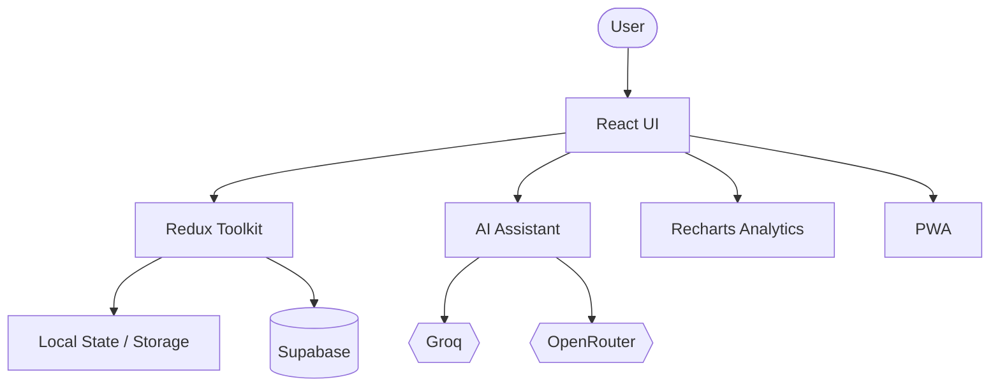

# Terme — Personal Productivity Dashboard

A modern personal productivity dashboard for managing notes, tasks, focus sessions, and daily activity, with optional cloud synchronization and AI assistance.

## Features

- 📝 Notes and task management
- ⏱️ Custom Pomodoro-style focus timer
- 📊 Weekly focus and productivity analytics
- 🤖 AI assistant with Groq and OpenRouter support
- 🔐 Optional Supabase authentication and cloud synchronization
- 🌐 English and Persian language support with RTL layout
- 🌓 Dark and light themes
- 😊 Local sentiment analysis for notes
- 📱 Installable Progressive Web App (PWA)
- 🔒 Study Guard — interactive focus-mode UX prototype

## Tech Stack

- React 18
- Redux Toolkit
- Tailwind CSS
- Supabase
- Recharts
- Vite
- Vite PWA
- Groq
- OpenRouter

## Architecture



The application uses a component-based React architecture with centralized state management through Redux Toolkit.

Supabase provides optional authentication and cloud persistence. When external services are not configured, the application can continue operating in local mode.

AI functionality is separated from the core dashboard so the main application remains usable without AI services.

## Project Structure

```text
src/
├── components/
├── context/
├── features/
├── lib/
├── App.jsx
├── i18n.js
├── index.css
├── main.jsx
└── store.js

public/
package.json
vite.config.js
tailwind.config.js
```

## Getting Started

### Prerequisites

- Node.js 18+
- npm

### Installation

```bash
git clone https://github.com/TermeBuilds/Personal-Dashboard.git
cd Personal-Dashboard
npm install
```

### Run Locally

```bash
npm run dev
```

The application will be available at:

```text
http://localhost:5173
```

## Environment Variables

Copy `.env.example` to `.env` and configure the services you want to use.

```text
VITE_SUPABASE_URL=
VITE_SUPABASE_ANON_KEY=
VITE_GROQ_API_KEY=
VITE_OPENROUTER_API_KEY=
```

The application can run in local mode without Supabase or AI configuration.

## Production Build

```bash
npm run build
npm run preview
```

## Study Guard

Study Guard is an interactive UX prototype for distraction-free focus sessions.

It simulates focus mode, contact management, dashboard locking, and automated study-status responses. It is intentionally presented as a prototype rather than a real SMS or operating-system integration.

## Project Goals

This project explores:

- Scalable React state management
- Data visualization
- Local-first application behavior
- Optional cloud persistence
- AI-assisted workflows
- Responsive UI design
- Progressive Web App architecture