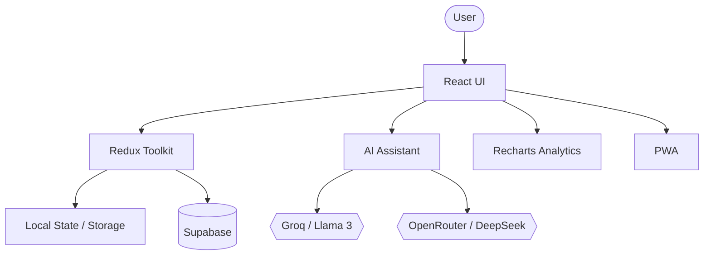

# Terme — Personal Productivity Dashboard

A modern personal productivity dashboard for managing tasks, notes, focus sessions, and daily activity — with optional cloud sync and AI assistance.

Built with React, Redux Toolkit, Tailwind CSS, Supabase, Recharts, Vite, and PWA.

## Features

- 📝 Create and manage personal notes and tasks
- ⏱️ Custom Pomodoro-style focus timer
- 📊 Weekly focus and productivity analytics
- 🤖 AI assistant with Llama 3 and DeepSeek support
- 🔐 Optional Supabase authentication and cloud synchronization
- 🌐 English and Persian language support with RTL layout
- 🌓 Dark and light themes without page reloads
- 😊 Local sentiment analysis for notes
- 📱 Installable Progressive Web App (PWA)
- 🔒 Study Guard — interactive UX prototype for distraction-free focus
- 💾 Local-first experience with graceful cloud and API fallbacks

## Tech Stack

- React 18
- Redux Toolkit
- Tailwind CSS
- Supabase
- Recharts
- Vite
- Vite PWA
- Groq / Llama 3
- OpenRouter / DeepSeek

## Architecture



The application follows a component-based React architecture with centralized state management through Redux Toolkit.

Supabase provides optional authentication and persistent cloud storage, while the application can continue running in local mode when external services are not configured.

AI functionality is isolated from the core dashboard, allowing the application to remain usable without AI services.

## Getting Started

### Prerequisites

- Node.js 18+
- npm

### Installation

```bash
git clone https://github.com/TermeBuilds/Personal-Dashboard.git
cd Personal-Dashboard
npm install
